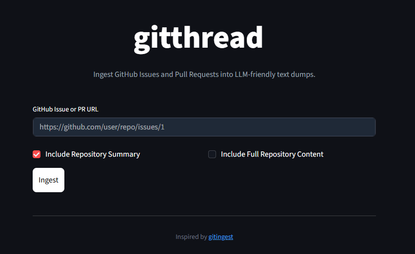

# gitthread

Ingest GitHub Issues and Pull Requests into LLM-friendly text dumps.



gitthread is a companion tool to gitingest that focuses on the conversational context of GitHub Issues and Pull Requests.

## Credits

This project is inspired by and uses the library from [gitingest](https://github.com/cyclotruc/gitingest). Special thanks to the gitingest team for their amazing work on codebase ingestion.

## Features

- **Issue & PR Ingestion**: Extract title, body, and all comments from any public GitHub issue or PR.
- **Smart Linking**: Automatically detects and ingests linked issues (e.g., #123 or "fixes #123") in PR descriptions.
- **Repository Context**: Integrates with gitingest to provide a summary or full content of the repository.
- **Concurrent Processing**: Optimized fetching of both thread and repository data.
- **LLM-Friendly**: Outputs clean Markdown formatted for easy consumption by LLMs.
- **CLI & Web**: Use it in your terminal or via a polished Streamlit dark-themed interface.

## Installation

```bash
pip install gitthread
```

## Usage

### CLI

```bash
gitthread https://github.com/user/repo/issues/1
```

### Web Interface

```bash
gitthread-web
```

## Docker

Run gitthread using Docker Compose on port 8095:

```bash
docker-compose up -d
```

The application will be available at `http://localhost:8095`. You can optionally provide a `GITHUB_TOKEN` in your environment to increase rate limits.

## License

MIT
